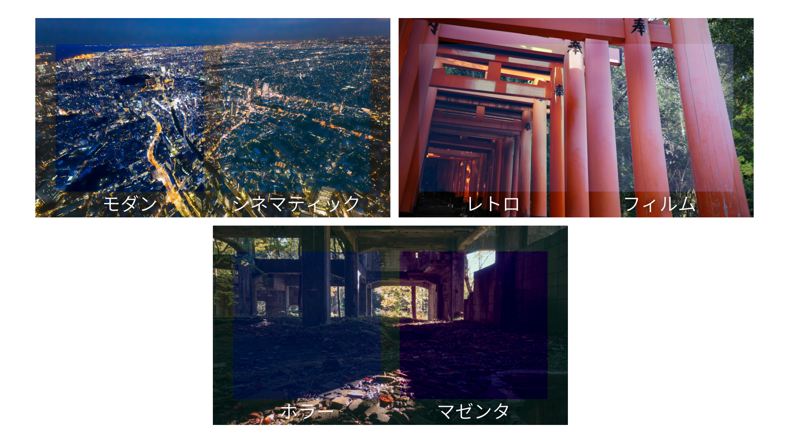
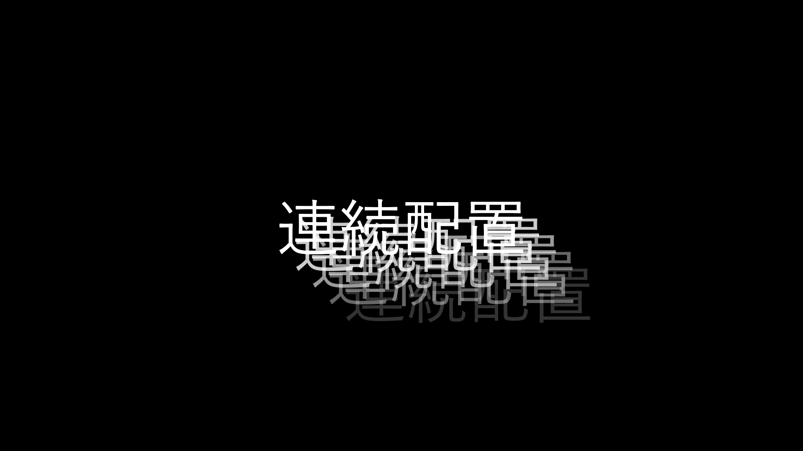
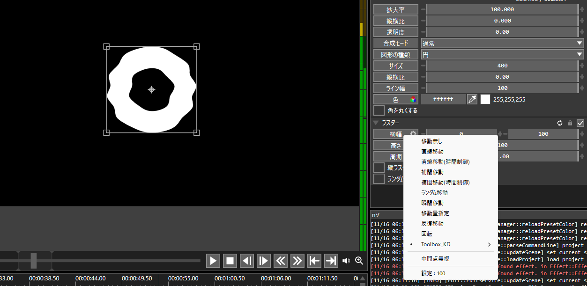

# Toolbox_KD
Aviutl2の汎用的に使えそうなスクリプト群です。

以下のスクリプトファイルが入っています。不要でしたら削除や無効化してください。

* KD_Palette
* KD_DepthMap
* KD_Animation (v1.1追加)
* KD_MOVE (v1.1追加)

# 動作環境
動作確認済み：Aviutl2 beta19b

# 導入方法
1. [Release](https://github.com/kurodonut825/Toolbox_KD/releases)から最新バージョンをダウンロード
1. zipを解凍
1. 中の`Toolbox_kurodonut`フォルダをまるごと、`aviutl2/Script`の中に移動させてください。

# スクリプト一覧
## KD_Palette
### カラーグレーディング
映像の色彩を調整して、雰囲気やトーンを調整します。
Aviutl1の拡張色域設定に近いです。RGB毎に細かい設定ができるので好みのカラグレを作れると思います。

### カラーグレーディング（簡易）
映像の色彩を調整して、雰囲気やトーンを調整します。カラーグレーディングのよくあるプリセットが数種類登録されています。（プリセットの名前は適当です）

効果の強弱が調整できるので映像の状態に応じてうまく調整してください。

### プリセット適用時のサンプル画像
素材：フリー素材ぱくたそ［ https://www.pakutaso.com ］

### 減色
色を減らします。
粒度を調整することで使用されている色の量が変化します。

## KD_DepthMap
### 深度マップ
※画像または映像の深度を計算した白黒の深度マップが必要です。

深度マップをもとに、ある地点より遠景にある景色をマスクします。
画像、映像どちらにも対応しています。

こういった使い方ならできると思っています。
* テキストなどを画像の特定の物体の後ろに配置しているように見せる。
* 特定のエリアより遠い部分にモザイクやぼかしを設定する。

### 参考：深度マップを写真から自作したい方へ
自分はこういうの使って深度マップを自作しました
https://github.com/DepthAnything/Depth-Anything-V2

参考：出力した深度マップ

## KD_Animation
### ドット風移動
対象のオブジェクトが、カクカクと移動するようになります。
ドット絵イラストを動かすなどの時にお使いください。

### 波形参照
座標、軸回転、拡大率、透明度、縦横比を音声に合わせて変化させます。

### 連続配置
対称のオブジェクトを、特定の座標方向、特定の規則で複製・配置します。

### 連続配置（角度指定）
対称のオブジェクトを、特定の角度で複製・配置します。

## KD_MOVE
### 音声参照
トラックバーから選択できるすべての項目に対して適用できます。

今流れている音声の音量に応じて、トラックバー項目を変化させます。

歯車マークから設定値を変更することで音量に対する変化量を調節できます。

※個別オブジェクトは仕様上、同一の変化量になります。

# LICENSE
このソフトウェアは MIT ライセンスのもとで公開されます。 詳細は [LICENSE](LICENSE) を参照してください。

# 連絡先
不具合や要望、分からない等ありましたら作成者のXに連絡ください。大体みてます。

https://x.com/kurodonut

# Change Log
## v1.1 (2025-11-16)
* 追加機能
    * ドット風移動
    * 波形参照
    * 連続配置
    * 連続配置（角度指定）
    * 音声参照
* 更新
    * ビルド用pyファイルを更新（スクリプトを利用する分には全く影響ないです。）
## v1.0 (2025-11-11)
* 初版公開