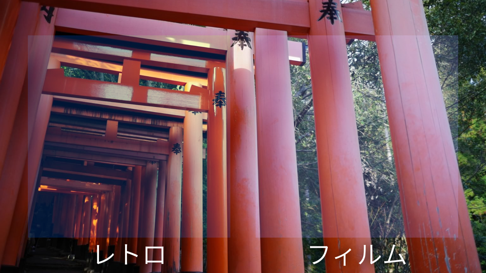
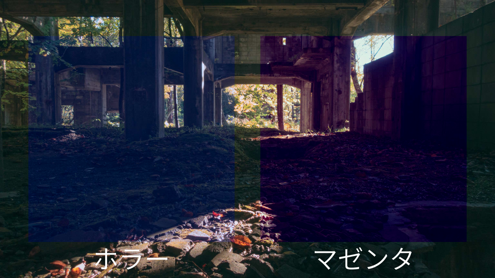
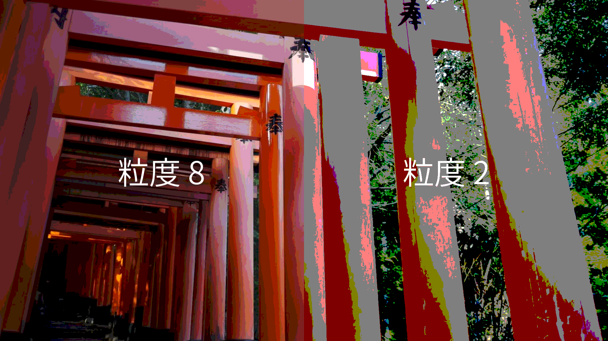
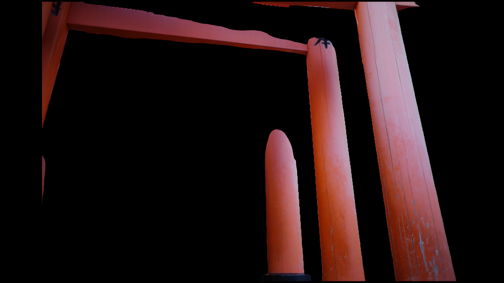
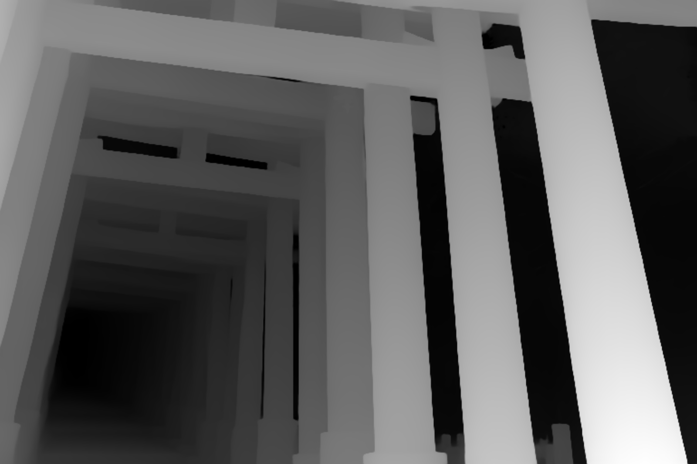
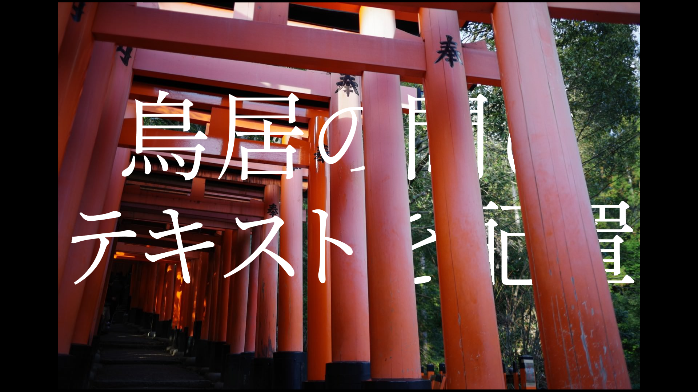

# Toolbox_KD
Aviutlの汎用的シェーダースクリプトです。

以下の二つのスクリプトが入っています。不要でしたら削除や無効化してください。
・Toolbox_KD
・DepthMap_KD

## 動作環境
動作確認済み：Aviutl2 beta18b

## 導入方法
1. [Release](https://github.com/kurodonut825/Toolbox_KD/releases)から最新バージョンをダウンロード
1. zipを解凍
1. 中の`Toolbox_kurodonut`フォルダをまるごと、`aviutl2/Script`の中に移動させてください。

## スクリプト一覧

### カラーグレーディング & カラーグレーディング（簡易）
映像の色彩を調整して、雰囲気やトーンを調整します。

#### カラーグレーディング
Aviutl1の拡張色域設定に近いです。RGB毎に細かい設定ができるので好みのカラグレを作れると思います。

#### カラーグレーディング（簡易）
カラーグレーディングのよくあるプリセットが数種類登録されています。
（プリセットの名前は適当です）

効果の強弱が調整できるので映像の状態に応じてうまく調整してください。

#### プリセット適用時のサンプル画像
素材：フリー素材ぱくたそ［ https://www.pakutaso.com ］

### 減色
色を減らします。
粒度を調整することで使用されている色の量が変化します。

### 深度マップ
※画像または映像の深度を計算した深度マップが必要です。

深度マップをもとに、ある地点より遠景にある景色をマスクします。
画像、映像どちらにも対応しています。

#### 参考：深度マップを写真から自作したい方へ
自分はこういうの使って深度マップを自作しました

https://github.com/DepthAnything/Depth-Anything-V2

参考：出力した深度マップ

#### 活用例
元画像とマスクした画像の間に文字を挟むことで、このような表現ができます。

## LICENSE
このソフトウェアは MIT ライセンスのもとで公開されます。 詳細は [LICENSE](LICENSE) を参照してください。

## 動かないときとか
不具合や要望、分からない等ありましたら作成者のXに連絡ください。大体みてます。

https://x.com/kurodonut

## Change Log
#### v1.0 (2025-11-11)
* 初版公開